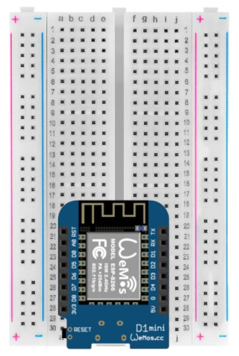
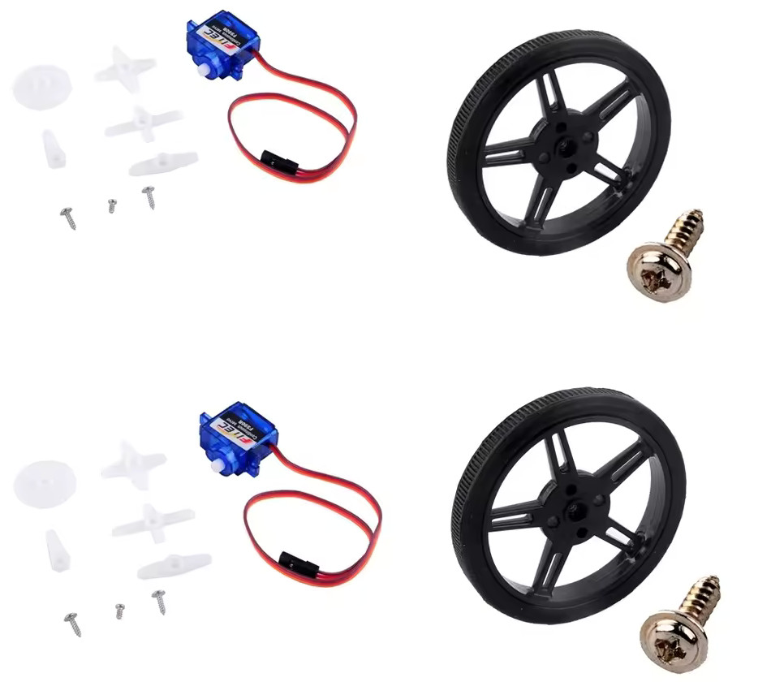
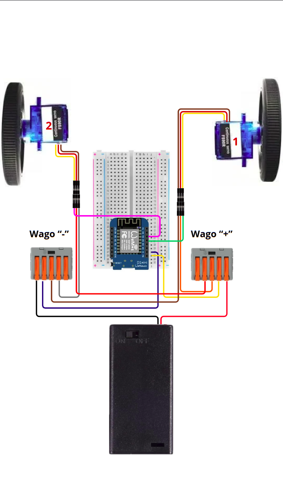
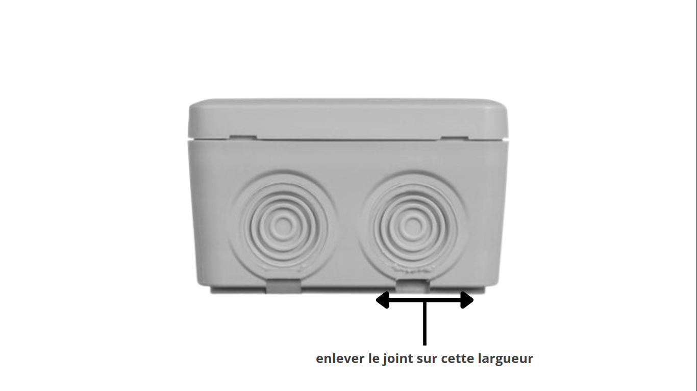

# petitBotLPDna

<h1>Wikidébrouillard petitbot nouvelle version :</h1>  

//photo : petitbot en boite elec  

<h2>Description : </h2> 

Petitbot = robot DIY à base de récup’
Ce petit robot est une création 100 % petits debrouillards, alliant ingéniosité et économie de moyens. Il est équipé :

- D’un microcontrôleur ESP8266 pour le piloter à distance (via Wi-Fi) et/ou le programmer selon vos besoins.

- De moteurs FS90R (servomoteurs pour une rotation continue), lui offrant une mobilité simple et aisé à contrôlé.

- D’alimentation par batteries 18650 (récupérées ou recyclées), assurant une autonomie optimale pour des projets nomades.

Conçu avec des matériaux de récupération (boîtier, roues, fils electrique), c’est une porte d’entrée idéale vers l’univers du DIY(DO IT YOURSELF = faire sois-même), de la robotique et de la programmation. il prouve qu’innovation, revalorisation et durabilité  peuvent aller de concert. Idéal pour simplement s’amuser ou commencé à apprendre en le personnalisant !

Discipline Scientifique : Arduino, electricité, informatique 

Difficulté : moyen + 

Durée : 1 journée 

Mots clés : Programmation , robot , récup , défis, plastique, Arduino , esp8266 électronique 

<h2>Liste de matériel </h2> 
<h3>🔧 Outils et matériel </h3>

- Tournevis (cruciforme et plat)
- Colle chaude ou ruban adhésif double face
- Cutter ou ciseaux
- Pince à dénuder (optionnel si vous savez utiliser très habillement le cutter )
- Fer à souder (optionnel, selon la version)
- pince a sertir (optionnel, selon la version )

<h3>📦 Matériel de base </h3>

Électronique :

- 1 ESP8266 D1 mini
- 2 moteurs FS90R 
- 1 module TP4056 (pour charger la batterie)
- 1 Batteries 18650 + support (ou pack de piles)
- 11 Fils électriques 5cm-10cm (dupond mâle-mâle ou simple à souder)
- 1 Interrupteur deux bornes 
- 2 wago 5 fils 222-415 (optionnel, selon la version)
- 1 platine de prototypage (optionnel, selon la version)
- des pièces de lego pour pouvoir adapter le bot à différents mode de jeu 

<h3>🏗️ 🛞 Structure et mobilité :</h3>

- Châssis (ouvert ou fermé selon la version) il peux être en bois, plastique ou imprimé 3D,etc... 
Pour ce tutotiel on vas utiliser une petit boite dérivation mais vous pouvez adapté n'importe quel contenant tant qu'il fait au moins 8.5*8.5cm, pour laisser assez d'espace au différents composants.
- 2 roues motrice (pieces spécifique ou bouchons de bouteilles, CDs, impréssion 3D, etc.)
- 1 Bille Roulettes Pivotantes ( pour la direction du petitbot)
- 1 bouchon en liège pour ajuster la hauteur de la roulette de direction 

-----

<h2>Introduction</h2>

Ce robot DIY est conçu pour être accessible à tous, quel que soit votre niveau ou vos ressources. Il existe plusieurs versions pour s’adapter à vos contraintes et à vos envies :

- Version 1 "démonstation" : pour faire des démonstration et création de ce robot 

- Version 2 "100 % récup’" : pour les écolos et les bricoleurs malins.

- Version 3 "sans soudure" : pour ceux qui veulent éviter l’électronique complexe.

- Version 4 "pièces neuves" : pour un montage plus fiable et durable.

- Version 5 "indestructible" : pour les robots qui doivent survivre à toutes les aventures !

⚠️ Pour ce tutoriel on vas vous guide dans la réalisation d'une version de démonstration sans soudure, la plus simple à réaliser possible⚠️ 

<h3>chapitre 1 Orgraniser les différents composants :</h3> 

- placer l'esp8266 sur la plaquette de prototypage 
   
---
- prenez deux wago et noté un moins (-) sur l'un et un plus (+) l'autre. (ça aidera pour l'organisation, la réalisation de ce tutoriel ainsi que le diagnostic si il y a un  problème) 🔍️vous pouvez ouvrir tous les leviers ~~80° 
   
---

- prépare 8 fils avec des connecteurs dupond M-M (si possible choisir 3 fils de couleur rouge/chaude, 3 fils de couleur noir/froide et 2 fils avec des couleurs différentes)
 
---
- prenez deux moteur FS90R et noté sur l'un "1" et sur l'autre "2"  (ça aidera pour l'organisation, la réalisation de ce tutoriel ainsi que le diagnostic si il y a un  problème)
 

<h3> chapitre 2 montage éléctrique de l'ESP8266: </h3>

1er étape : vérifier que l'interrupteur sur le boitier pile est bien sur "OFF" 

---
2ème étape : suivre dans l'ordre 

- placer le fil noir du boitier de pile dans le wago "-" 
- placer le fil rouge du boitier de pile dans le wago "+"
- prenez un fil de couleur froide placer une extremité dans le wago - et l'autre extremité dans la broche en face du "G" sur l'esp 
- prenez un fil de couleur chaude placer une extremité dans le wago + et l'autre extremité dans la broche en face du "5V" sur l'esp8266  

3ème étape : mettre l'interrupteur sur "ON" et voir si la led sur l'esp s'allumé (c'est bon signe!)

<h3>chapitre 3 montage des moteurs : </h3>

1er étape : vérifier que l'interrupteur sur le boitier pile est bien sur "OFF" 

---
2ème étape : suivre dans l'ordre 

- faite un groupe de trois fils dupont avec un fil de couleur froide (il représente le "-") , un de couleur chaude (il représente le "+") et un fil de couleur différentes (il représente le signal ) scotché les trois au niveau de la partie noir du connecteur dupont 

- branché le moteur sur l'un des groupe déjà préparer

- faire la même chose avec l'autre groupe de fils pour le deuxième moteur
--- 

- placer les deux fils de couleur froide des deux groupe de fils que vous venez de faire dans le wago (-) 
- placer les deux fils de couleur chaude des deux groupe de fils que vous venez de faire dans le wago (+)
- placer le fils "signal" du moteur "1" au niveau de la broche en face du "D2" sur l'esp8266
- placer le fils "signal" du moteur "2" au niveau de la broche en face du "D1" sur l'esp8266

<h3>chapitre 4 montage dans le chassis : </h3>

- on as choisie une boite de dérivation electrique avec 8 entrées 

- on commence par retiré un partie du joint en du dessous du boitier 

- faite chauffer la colle chaude et placé les moteur à l'arrière du boitier 

- à l'avant du chassis vous pouvez placer la roulette et adapté la hauteur avec un bouchon en liège et de la colle chaude 

- débranché les fils moteur au niveau de leur jonction les fils groupé 
- faite passer les fils des moteurs à traver les deux entrées en dessous de la boite de dérivation 
- reconnecter les groupe de fils et les fils moteurs 

- commencer par mettre les wago dans le fond de la boite-chassis puis la plaque de prototypage attender d'avoir programmer l'esp avant de mettre le boitier de pile et de refermé le boitier 

<h3>chapitre 5 programmation de l'esp : </h3>

vous pouvez soit téléchager le fichier en .ino pour pouvoir l'ouvrir avec IDE Arduino et les fichiers des pages sur visual-studio-code 

<h3>chapitre 6 ajout des options : </h3>

<h3>chapitre 7 Les autres version du petitbot : </h3>

<h3>liste de liens pour l'achat </h3>
